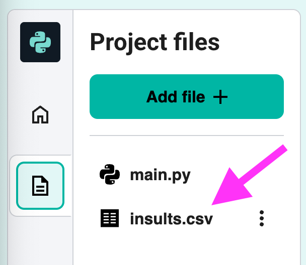

## Open and read from a file

--- task ---

Open the <a href="https://editor.raspberrypi.org/en/projects/shakespearean-insult-starter" target="_blank">starter project</a>.

--- /task ---

--- task ---

In the sidebar, click on the `insults.csv` file and take a look at the contents. 

--- /task ---

--- task ---

Click back to the `main.py` file. Add some code to open the insults file in read mode (`"r"` means *read mode*), read a line, and output the result:

--- code ---
---
language: python
line_numbers: true
line_number_start: 1
---
with open("insults.csv", "r") as f:
        line = f.readline()
        print(contents)

--- /code ---

--- /task ---

--- task ---

Click **Run** and you should see the first line of the file displayed in the output section.

--- /task ---

