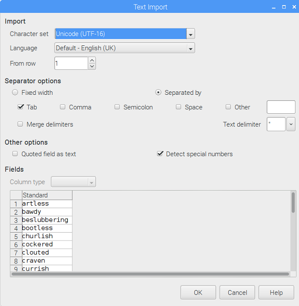
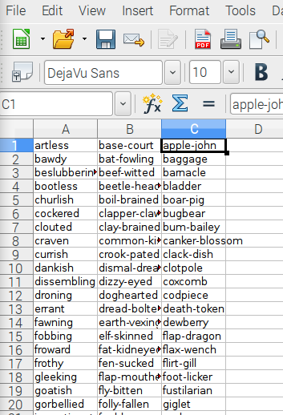
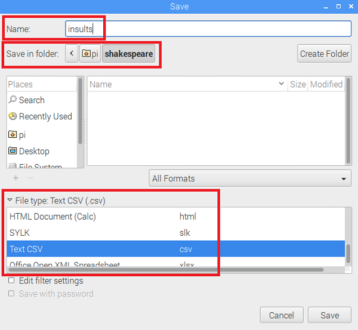
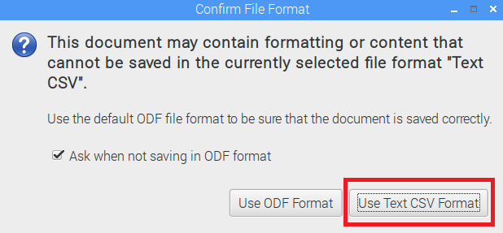

## Putting your insults into a CSV file

- You will need to find some suitable Shakespearean words to use. Make sure to only use Shakespearean words as insults - they are witty, intelligent, and unlikely to actually offend your friends! We found a big list of [Shakespearean insults](https://www.theatrefolk.com/free-resources) (scroll down to the "Fun activities" section).

- Now open up a document in a spreadsheet editor. These instructions are for LibreOffice Calc, which is included on the latest distribution of Raspbian, but this process works in a very similar way in other spreadsheet programs such as Microsoft Excel. Copy the first column of insults from the PDF file. Now right-click on cell A1 in your spreadsheet and select **Paste Special**. In the pop up box which appears, make sure **Unformatted text** is selected before pressing OK. Then press OK again when you're presented with the box below.

 

 You should see your insult words displayed in the spreadsheet, with one word in each row, like this:

 

- Repeat this for the second and third columns, pasting them into columns B and C of the spreadsheet.

 

- Now save your file as "insults" and make sure to change the **File type** drop-down to **Text CSV** before pressing Save.

 

- If a box pops up, choose to save the file in Text CSV format. Press OK on any further pop ups.

 

- Once your file has been saved, you can check that the data is now in CSV format. Locate the file using the file explorer, then right-click on the file and select "Text editor" to open it up as plain text. You should see the insults you pasted in, separated by commas.

 

