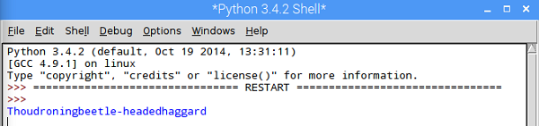

## Randomly choosing an insult

Now we have three lists, let's write a function to choose a random word from each list and create a new insult.

- At the very start of your program, import the `random` library:

 ```python
 import random
 ```

- Immediately underneath that, define a function called `insult_me()`:

 ```python
 def insult_me():
 ```

- We can tell Python which code is inside the function by *indenting* the lines of code after the function definition. Add some code *inside the function* to choose a random word from `list_a`, `list_b`, and `list_c`. The first word has been done for you in the example below, but you need to work out how to choose a random word from lists B and C yourself.

 ```python
 def insult_me():
 word_a = random.choice(list_a)
 ```

- Still writing your code *inside the function*, construct your insult, using the *concatenation* symbol (`+`) to join the words together. Then add a `print` statement to display the insult:

 ```python
 insult = "Thou" + word_a + word_b + word_c
 print(insult)
 ```

- If you run your program now, nothing new will happen. This is because code inside a function won't be executed until the function is **called**. Find the line of code in your program where you `print( list_a )` and delete it. In its place, call the function you just created:

 ```python
 insult_me()
 ```

- Save your program and run it using F5. You should see a random insult, but there's a problem - the words are all stuck together with no spaces in between!

 

 The `+` is like the programmer's glue - it joins **strings** together. The string for a space is `" "`, so we could alter the code and put a space between `word_a` and `word_b` like this:

 ```python
 insult = "Thou" + word_a + " " + word_b + word_c
 ```

 See if you can work out where to *concatenate* more spaces to make the insult display properly. You could even concatenate a `"!"` onto the end of your insult if you like.

- Save and run your program using F5. You should see a random insult appear!

 

 Run your program again and you should see a different insult each time.

