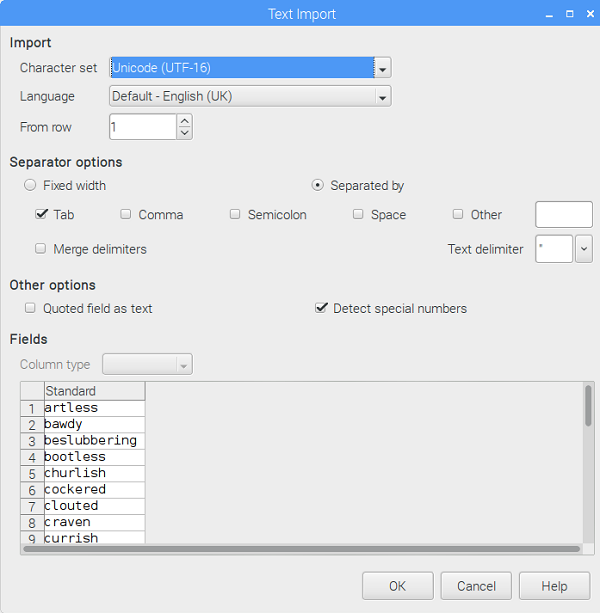
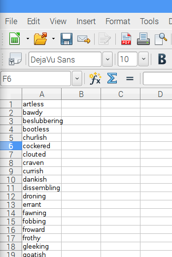

## Poniendo tus insultos en un archivo CSV

Necesitarás encontrar algunas palabras de Shakespeare adecuadas para usar. Asegúrate de usar solo palabras Shakespearianas como insultos - ¡son ingeniosas, inteligentes y poco probable de que realmente ofendan a tus amigos! Encontramos una gran lista de [insultos Shakespearianos](https://www.theatrefolk.com/freebies/shakespearean-insults.pdf) en [https://www.theatrefolk.com/free-resources/shakespeare](https://www.theatrefolk.com/free-resources/shakespeare).

Puedes crear tu propio archivo CSV de insultos siguiendo las instrucciones a continuación o descargar un archivo [insults.csv](resources/insults.csv) pre-construido.

- Ahora abre un documento en un editor de hojas de cálculo. Estas instrucciones son para LibreOffice Calc, que se incluye en la última distribución de Raspbian, pero este proceso funciona de forma muy similar en otros programas de hojas de cálculo como Microsoft Excel. Copia la primera columna de insultos del archivo PDF de [insultos Shakespearianos](https://www.theatrefolk.com/freebies/shakespearean-insults.pdf). Ahora haz clic derecho en la celda A1 en tu hoja de cálculo y selecciona **Pegado especial**. En el cuadro que aparece, asegúrate de seleccionar **Texto sin formato** antes de presionar OK. Presiona OK nuevamente cuando veas el cuadro a continuación.

  

  Deberías ver tus palabras de insulto en la hoja de cálculo, con una palabra en cada fila, como esta:

  

- Repite esto para la segunda y la tercera columna, pegándolos en las columnas B y C de la hoja de cálculo.

  

- Ahora guarda tu archivo como "insultos" y asegúrate de cambiar el menú desplegable **Tipo de archivo** a **Texto CSV** antes de presionar Guardar.

  

- Si aparece una ventana emergente, elije guardar el archivo en formato de texto CSV. Presiona OK en cualquier otra ventana emergente.

  

- Una vez que hayas guardado tu archivo, puedes verificar que los datos están ahora en formato CSV. Localiza el archivo usando el explorador de archivos, luego haz clic derecho en el archivo y seleccione "Editor de texto" para abrirlo como texto plano. Deberías ver los insultos que has pegado, separados por comas.

  

