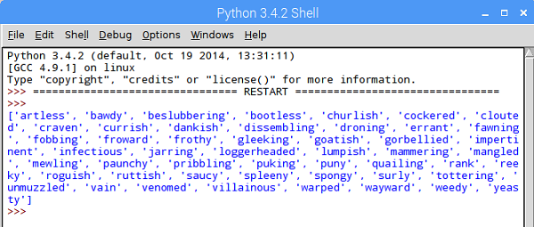
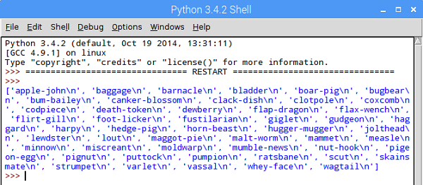

## Listas en Python

- Añadiremos algo de código para leer el archivo línea por línea y dividir cada columna en una lista separada. Intenta planear esto tú mismo en pseudocódigo antes de ver nuestra solución a continuación:

  ```
  CREAR lista_a, lista_b, lista_c como LISTAS VACIAS
  ABRIR insultos.csv en modo lectura
    POR cada línea del archivo, LEER EN la variable línea
      palabras = SEPARAR CADA línea usando "," EN UNA LISTA
      ANEXAR la primera palabra en las palabras A lista_a
      ANEXAR la segunda palabra en las palabras A lista_b
      ANEXAR la tercera palabra en las palabras A lista_c
    TERMINAR BUCLE
  IMPRIME lista_a
  ```

  La parte más desconocida de este código es probablemente `palabras = SEPARAR CADA línea usando "," EN UNA LISTA`. Aquí usaremos la función incorporada `split()` de Python para dividir la línea de texto dondequiera que haya una coma, y guardar los resultados en una lista llamada `palabras`.

- Aquí está el código Python correspondiente al código que planeamos arriba. Una vez más, puedes intentar traducir tu pseudocódigo en Python antes de mirar la solución a continuación. Elimina tu código existente y reemplázalo con el nuevo código:

--- collapse ---
---
title: Mostrar el código
---

  ```python
  lista_a = []
lista_b = []
lista_c = []

with open("insults.csv", "r") as f:
    for linea in f:
        palabras = linea.split(",")
        lista_a.append(palabras[0])
        lista_b.append(palabras[1])
        lista_c.append(palabras[2])

print(lista_a)


  ```

--- /collapse ---

- Guarda y ejecuta tu programa presionando F5. Puedes observar que el programa emite una lista de todas las palabras que pertenecen a la columna A.

  

- Cambia tu código para también imprimir y verificar las listas B y C. Deberías detectar un problema.

Cuando imprimes la `lista_c` para verificarla, notarás algo extraño - un carácter adicional `\n` ha sido añadido al final de cada una de las palabras:

  

  El carácter `\n` no es una sorpresa cuando descubres que significa "nueva línea". ¡Está ahí porque en nuestro archivo CSV original, cada grupo de tres palabras insultantes fue almacenado en una *nueva línea*! Sin embargo, no queremos mostrarlo en nuestro insulto, por lo que podemos agregar algo de código para deshacernos de él.

- Encuentra esta línea en tu código:

  ```python
  lista_c.append(palabras[2])
  ```

  ...y añade `.strip()` al final de la palabra que estás añadiendo para eliminar automáticamente el `\n` y cualquier otro **carácter de espacio en blanco**.

  ```python
  lista_c.append(palabras[2].strip() )
  ```

