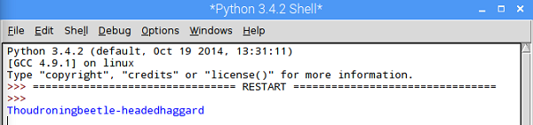

## Elegir aleatoriamente un insulto

Ahora tenemos tres listas, vamos a escribir una función para elegir una palabra aleatoria de cada lista y crear un nuevo insulto.

- Al comienzo de tu programa, importa la librería `aleatoria`:

  ```python
  import random
  ```

- Inmediatamente debajo de eso, define una función llamada `insúltame()`:

    ```python
    def insultame():
    ```

- Podemos decirle a Python qué código está dentro de la función al *indentar* las líneas de código después de la definición de la función. Añade un código *dentro de la función* para elegir una palabra aleatoria de `lista_a`, `lista_b`, y `lista_c`. La primera palabra se ha hecho para ti en el ejemplo a continuación, pero necesitas averiguar cómo elegir una palabra aleatoria de las listas B y C por ti mismo.

    ```python
    def insultame():
    palabra_a = random.choice(lista_a)
    ```

- Sigue escribiendo tu código *dentro de la función*, y construye tu insulto, usando el símbolo (`+`) de *concatenación* para unir las palabras. Luego agrega un comando para `imprimir` y mostrar el insulto:

  ```python
  insulto = "Tú" + palabra_a + palabra_b + palabra_c
  print(insulto)
  ```

- Si ejecutas tu programa ahora, no pasará nada nuevo. Esto se debe a que el código dentro de una función no será ejecutada hasta que la función sea **llamada**. Encuentra la línea de código en tu programa donde ejecutas `print( lista_a )` y bórrala. En su lugar, llama a la función que acabas de crear:

  ```python
  insultame()
  ```

- Guarda tu programa y ejecútalo usando F5. Deberías ver un insulto aleatorio, pero hay un problema - ¡las palabras están atrapadas juntas sin espacios entre ellas!

  

  El `+` es como el pegamento del programador - une a las **cadenas**. La cadena para un espacio es `" "`, así que podríamos modificar el código y poner un espacio entre `palabra_a` y `palabra_b` así:

  ```python
  insulto = "Tú" + palabra_a + " " + palabra_b + palabra_c
  ```

  Mira si puedes averiguar dónde *concatenar* más espacios para hacer que el insulto se muestre correctamente. Podrías incluso concatenar un `"!"` al comienzo y al final de tu insulto, si quieres.

- Guarda y ejecuta tu programa presionando F5. ¡Deberías ver que un insulto aleatorio aparece!

    

    Ejecuta tu programa de nuevo y deberías ver un insulto diferente cada vez.

