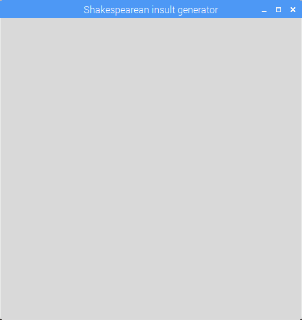

## Mostrar el resultado en una interfaz gráfica

Si deseas hacer que tu generador de insultos sea fácil de usar, podría añadir una interfaz gráfica básica. Asegúrate de haber seguido las [instrucciones de instalación de software](https://learning-admin.raspberrypi.org/es-LA/projects/shakespearean-insult-generator/what-you-will-need) para instalar la librería `guizero` antes de intentar esta sección.

- Al comienzo de tu programa, después de la línea de código donde se importó la librería `random`, importa la librería `guizero`:

  ```python
  from guizero import App, Text, PushButton
  ```

- Ahora al final de tu programa, añade código para crear una `App`. Esta es una simple ventana de interfaz gráfica donde mostraremos tu insulto.

  ```python
  app = App("Generador de insultos Shakespearianos")
  app.display()
  ```

- Guarda tu programa y ejecútalo usando F5. Deberías ver aparecer una ventana casi completamente en blanco, con el título "Generador de insultos Shakespearianos".

  

  Puedes notar que cuando ejecutas el programa, se sigue imprimiendo un insulto en el shell de Python, aunque ahora queremos mostrar nuestro insulto en la interfaz gráfica. Esto se debe a que codificamos la función `insultame()` para *imprimir* el insulto en lugar de solo generarlo.

- Vuelve a tu función `insultame()` y sustituye la línea `print(insulto)` por la línea `return insulto`. Esto hará que el insulto se devuelva de la función para que podamos usarlo, en lugar de simplemente imprimirlo.

- Elimina la línea de código que llama a la función `insultame()`.

- Ahora añade `Texto` para mostrar tu insulto. Esta línea de código debe ir entre la línea `app =` y la línea `app.display()`:

  ```python
  mensaje = Text(app, insultame() )
  ```

  Esta línea de código crea un objeto `Texto`, lo agrega a la `app`, y luego llama a la función `insultame()` para obtener un insulto para mostrar.

  

- Ahora vamos a añadir un `PushButton` en la línea inmediatamente después del `Texto`.

  ```python
  boton = PushButton(app, nuevo_insulto, text="Insúltame de nuevo")
  ```

  Este código crea un objeto `PushButton` y lo añade a la `app`. El botón llamará a la función `nuevo_insulto` (el cual aún no hemos escrito) cuando este es presionado, y mostrará el texto `"Insúltame de nuevo"`.

- Escribe la función `nuevo_insulto()` que será llamada cuando se presione el botón. Deberías poner este código inmediatamente después de tu función `insultame()`, pero ten cuidado de **no** indentar la primera línea de la función, de lo contrario Python pensará que este código es parte de la función `insultame()` también.

    ```python
    def nuevo_insulto():
    nuevo_insulto = insultame()
    mensaje.value = nuevo_insulto
    ```

  Esta función llama a la función `insultame()` para generar un nuevo insulto aleatorio, y luego establece el mensaje en la interfaz gráfica para que sea el insulto recientemente generado.

  

- ¡Ejecuta el programa usando F5 y disfruta creando un flujo de insultos Shakespearianos al presionar un botón! El código terminado está [aquí](resources/shakespeare.py) si quieres revisar tu código.

