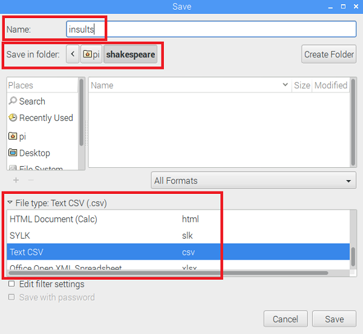

## अपने अपमानों को एक CSV फ़ाइल में डालना

आपको कुछ उपयुक्त शेक्सपियरियन शब्द ढूंढने होंगे उनका उपयोग करने के लिए। केवल शेक्सपियरियन शब्दों का अपमान के रूप में उपयोग करना सुनिश्चित करें - वे मजाकिया, बुद्धिमान हैं, और वास्तव में अपने दोस्तों को अपमानित करने की संभावना नहीं है! हमें [शेक्सपियरेन अपमानों](https://www.theatrefolk.com/freebies/shakespearean-insults.pdf) की एक बड़ी सूची मिली [https://www.theatrefolk.com/free-resources/shakespeare](https://www.theatrefolk.com/free-resources/shakespeare)पर।

आप नीचे दिए गए निर्देश का पालन करके अपना स्वयं का अपमान CSV फ़ाइल बना सकते हैं या पूर्व-निर्मित [insults.csv](resources/insults.csv) फ़ाइल डाउनलोड कर सकते हैं।

- अब एक स्प्रेडशीट संपादक में एक दस्तावेज़ खोलें। ये निर्देश LibreOffice Calc के लिए हैं, जो Raspbiam के नवीनतम वितरण में शामिल है, लेकिन यह प्रक्रिया Microsoft Excel जैसे अन्य स्प्रेडशीट कार्यक्रमों में बहुत समान तरीके से काम करती है। [शेक्सपियरियन अपमान](https://www.theatrefolk.com/freebies/shakespearean-insults.pdf) PDF फ़ाइल से अपमानों के पहले कॉलम को कॉपी करें । अब अपनी स्प्रेडशीट में cell A1 पर राइट-क्लिक करें और **Paste Special** चुनें । दिखाई देने वाले पॉप अप बॉक्स में, सुनिश्चित करें कि **Unformatted text** चुना हुआ है OK दबाने से पहले। फिर नीचे दिए गए बॉक्स के साथ प्रस्तुत किए जाने पर OK फिर से दबाएं।

  

  You should see your insult words displayed in the spreadsheet, with one word in each row, like this:

  

- Repeat this for the second and third columns, pasting them into columns B and C of the spreadsheet.

  

- Now save your file as "insults" and make sure to change the **File type** drop-down to **Text CSV** before pressing Save.

  

- If a box pops up, choose to save the file in Text CSV format. Press OK on any further pop ups.

  

- Once your file has been saved, you can check that the data is now in CSV format. Locate the file using the file explorer, then right-click on the file and select "Text editor" to open it up as plain text. You should see the insults you pasted in, separated by commas.

  

