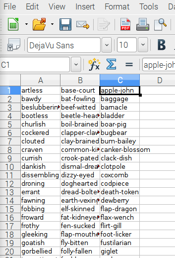
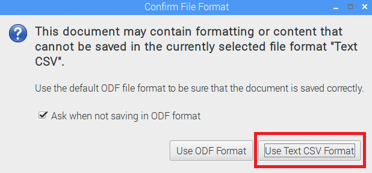
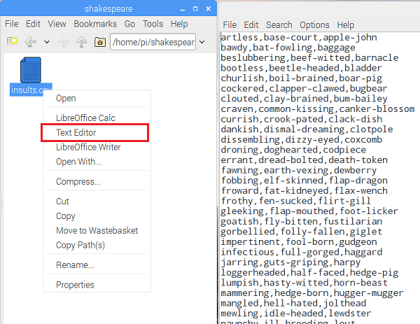

## Je beledigingen in een CSV-bestand stoppen

Je moet enkele geschikte Shakespeare-woorden vinden om te gebruiken. Zorg ervoor dat je alleen Shakespeare-woorden gebruikt als beledigingen - ze zijn grappig, intelligent en het is onwaarschijnlijk dat ze je vrienden echt beledigen! We hebben een grote lijst van [Shakespearean-beledigingen](https://www.theatrefolk.com/freebies/shakespearean-insults.pdf) op [https://www.theatrefolk.com/free-resources/shakespeare](https://www.theatrefolk.com/free-resources/shakespeare) gevonden.

Je kunt je eigen CSV-bestand met beledigingen maken door de onderstaande instructie te volgen of een vooraf gebouwd [insults.csv](resources/insults.csv) bestand downloaden.

- Open nu een document in een spreadsheet-editor. Deze instructies zijn voor LibreOffice Calc, dat is opgenomen in de nieuwste distributie van Raspbian, maar dit proces werkt op een vergelijkbare manier in andere spreadsheet programma's zoals Microsoft Excel. Kopieer de eerste kolom met beledigingen uit het [Shakespeareaanse beledigingen](https://www.theatrefolk.com/freebies/shakespearean-insults.pdf) PDF-bestand. Klik nu met de rechtermuisknop op cel A1 in je spreadsheet en selecteer **Plakken speciaal**. Zorg ervoor dat in het pop-upvenster dat verschijnt **Niet-opgemaakte tekst** is geselecteerd voordat je op OK drukt. Druk vervolgens nogmaals op OK wanneer het onderstaande vak wordt weergegeven.

  

  Je zou je beledigende woorden in de spreadsheet moeten zien, met één woord in elke rij, zoals dit:

  

- Herhaal dit voor de tweede en derde kolom en plak ze in kolom B en C van de spreadsheet.

  

- Sla je bestand nu op als "beledigingen" en zorg ervoor dat je de vervolgkeuzelijst **Bestandstype** wijzigt in **Tekst CSV** voordat je op Opslaan drukt.

  

- Als er een vak verschijnt, kies je ervoor om het bestand op te slaan in Tekst CSV-indeling. Druk op OK bij verdere pop-ups.

  

- Nadat jouw bestand is opgeslagen, kun je controleren of de gegevens nu in CSV-indeling zijn. Zoek het bestand met behulp van de bestandsverkenner, klik vervolgens met de rechtermuisknop op het bestand en selecteer "Teksteditor" om het als gewone tekst te openen. Je zou de beledigingen moeten zien die je hebt geplakt, gescheiden door komma's.

  

