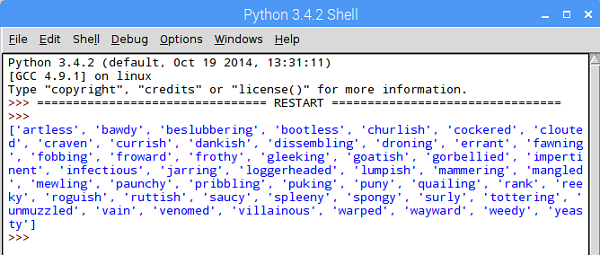
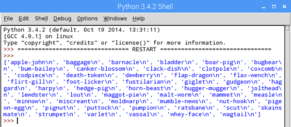

## Lijsten in Python

- We zullen code toevoegen om het bestand regel voor regel te lezen en elke kolom in een afzonderlijke lijst te splitsen. Probeer dit zelf in pseudocode te plannen voordat je onze onderstaande oplossing bekijkt:

  ```
  CREATE list_a, list_b, list_c as BLANK LISTS
  OPEN insults.csv in read mode
    FOR each line in the file, READ INTO variable line
      words = SPLIT line EVERY "," INTO A LIST
      APPEND first word IN words TO list_a
      APPEND second word IN words TO list_b
      APPEND third word IN words TO list_c
    END WHILE
  PRINT list_a
  ```

  Het meest onbekende deel van deze code is waarschijnlijk `words = SPLIT line EVERY "," INTO A LIST`. Hier zullen we de ingebouwde `split()` functie van Python gebruiken om de tekstregel op te splitsen waar een komma is en de resultaten op te slaan als een lijst met de naam `woorden`.

- Hier is de overeenkomstige Python-code voor de code die we hierboven hadden gepland. Nogmaals, je kunt jouw pseudocode in Python vertalen voordat je naar de onderstaande oplossing kijkt. Verwijder jouw bestaande code en vervang deze door de nieuwe code:

--- collapse ---
---
title: toon de code
---

  ```python
  list_a = []
  list_b = []
  list_c = []

  with open("insults.csv", "r") as f:
      for line in f:
          words = line.split(",")
          list_a.append(words[0])
          list_b.append(words[1])
          list_c.append(words[2])

  print( list_a )


  ```

--- /collapse ---

- Sla jouw programma op en druk op F5. Je zult erachter komen dat het programma een lijst uitvoert met alle woorden die je in kolom A plaatst.

  

- Wijzig jouw code om ook de lijsten B en C af te drukken en te controleren. Je zou een probleem moeten ontdekken.

Wanneer je `list_c` uitvoert om het te controleren, zul je iets vreemds opmerken - er is een extra `\n` teken toegevoegd aan het einde van elk van de woorden:

  

  Het karakter `\n` is geen verrassing als je erachter komt dat het "nieuwe regel" betekent. Het is er omdat in ons oorspronkelijke CSV-bestand elke groep van drie beledigende woorden werd opgeslagen op een *nieuwe regel*! We willen het echter niet in onze belediging weergeven, dus we kunnen wat code toevoegen om er vanaf te komen.

- Zoek deze regel in jouw code:

  ```python
  list_c.append(words[2])
  ```

  ... en voeg `.strip()` toe aan het einde van het woord dat je toevoegt, om automatisch de `\n` en alle andere **witruimte-tekens** te verwijderen.

  ```python
  list_c.append( words[2].strip() )
  ```

