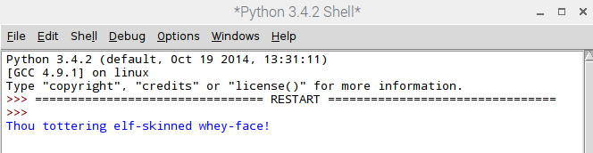

## Willekeurig een belediging kiezen

Nu hebben we drie lijsten, laten we een functie schrijven om uit elke lijst een willekeurig woord te kiezen en een nieuwe belediging te maken.

- Aan het begin van je programma importeer je de `random` bibliotheek:

  ```python
  import random
  ```

- Direct daaronder definieer je een functie met de naam `insult_me()`:

    ```python
    def insult_me():
    ```

- We kunnen Python vertellen welke code binnen de functie valt door de code regels te laten *inspringen* na de definitie van de functie. Voeg code *binnen de functie* toe om een willekeurig woord te kiezen uit `list_a`, `list_b` en `list_c`. Het eerste woord is in het onderstaande voorbeeld voor je gedaan, maar je moet zelf bepalen hoe je een willekeurig woord uit de lijsten B en C kunt kiezen.

    ```python
    def insult_me():
        word_a = random.choice(list_a)
    ```

- Schrijf nog steeds je code *binnen de functie*, construeer je belediging en gebruik het *samenvoeg* symbool (`+`) om de woorden samen te voegen. Voeg vervolgens een instructie voor `afdrukken` toe om de belediging weer te geven:

  ```python
  insult = "Thou" + word_a + word_b + word_c
  print(insult)
  ```

- Als je jouw programma nu uitvoert, gebeurt er niets nieuws. Dit komt omdat code binnen een functie pas wordt uitgevoerd als de functie **wordt aangeroepen**. Zoek de coderegel in jouw programma waar je `print (list_a)` en verwijder deze. Roep in plaats daarvan de functie op die je zojuist hebt gemaakt:

  ```python
  insult_me()
  ```

- Sla jouw programma op en voer het uit met F5. Je zou een willekeurige belediging moeten zien, maar er is een probleem - de woorden zitten allemaal aan elkaar zonder spaties ertussen!

  

  De `+` is als de lijm van de programmeur - hij verbindt **strings** samen. De tekenreeks voor een spatie is `" "`, dus we kunnen als volgt de code wijzigen en een spatie plaatsen tussen `word_a` en `word_b`:

  ```python
  insult = "Thou" + word_a + " " + word_b + word_c
  ```

  Kijk of je kunt bepalen waar je meer spaties moet *toevoegen* om de belediging op het scherm goed te maken. Je kunt zelfs een `"!"` toevoegen op het einde van je belediging als je wilt.

- Sla jouw programma op en voer het uit met F5. Je zou een willekeurige belediging moeten zien verschijnen!

    

    Voer je programma opnieuw uit en je zou elke keer een andere belediging moeten zien.

