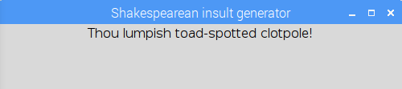
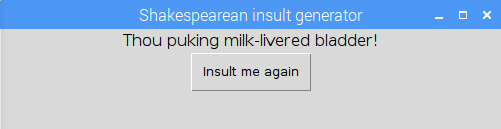

## Het resultaat weergeven op een GUI

Als je jouw beledigingsgenerator gebruiksvriendelijk wilt maken, kunt je een eenvoudige GUI toevoegen. Zorg ervoor dat je [software-installatie-instructies](https://learning-admin.raspberrypi.org/nl-NL/projects/shakespearean-insult-generator/what-you-will-need) hebt gevolgd om de `guizero` bibliotheek te installeren voordat je dit gedeelte probeert.

- Aan het begin van jouw programma, na de coderegel waar je de `random` bibliotheek hebt geïmporteerd, importeer je de `guizero` bibliotheek:

  ```python
  from guizero import App, Text, PushButton
  ```

- Voeg nu helemaal aan het einde van jouw programma code toe om een `app` te maken. Dit is een eenvoudig GUI-venster waar we jouw belediging zullen tonen.

  ```python
  app = App("Shakespearean insult generator")
  app.display()
  ```

- Sla jouw code op en voer deze uit met F5. Je zou een hoofdzakelijk leeg venster moeten zien verschijnen, met de titel "Shakespearean insult generator".

  

  Het valt je misschien op dat wanneer je het programma uitvoert, er nog steeds een belediging wordt afgedrukt in de Python-shell, ook al willen we onze belediging nu op de GUI weergeven. Dit komt omdat we de functie `insult_me()` hebben gecodeerd om de belediging *af te drukken* plaats van deze alleen te genereren.

- Ga terug naar je `insult_me()` functie en vervang de regel `print(insult)` door de regel `return insult`. Dit zal ervoor zorgen dat de belediging van de functie wordt teruggegeven, zodat we het kunnen gebruiken, in plaats van het gewoon af te drukken.

- Verwijder de coderegel die de functie `insult_me()`aanroept.

- Voeg nu wat `Text` (tekst) toe om je belediging weer te geven. Deze coderegel moet tussen de `app =` regel en de `app.display()` regel staan:

  ```python
  message = Text(app, insult_me() )
  ```

  Deze regel code maakt een `Text` object, voegt het toe aan de `app`, en roep vervolgens de functie `insult_me()` aan om een belediging te kunnen weergeven.

  

- Laten we nu een `PushButton` (drukknop) toevoegen aan de regel direct na de `Text`.

  ```python
  button = PushButton(app, new_insult, text="Insult me again")
  ```

  Deze code maakt een `PushButton` object en voegt dit toe aan de `app`. De knop roept de functie `new_insult` aan (die we nog niet hebben geschreven) wanneer deze wordt ingedrukt en geeft de tekst `"Insult me again"` (Beledig me opnieuw).

- Schrijf de functie `new_insult()` die wordt aangeroepen wanneer de knop wordt ingedrukt. Je moet deze code onmiddellijk achter jouw `insult_me()` functie plaatsen, maar let dat je de eerste regel van de functie **niet** laten inspringen, anders denkt Python dat deze code ook deel uitmaakt van de `insult_me()` functie.

    ```python
    def new_insult():
        new_insult = insult_me()
        message.value = new_insult
    ```

  Deze functie roept de functie `insult_me()` aan om een nieuwe willekeurige belediging te genereren en stelt vervolgens het bericht op de GUI in als de nieuw gegenereerde belediging.

  

- Start het programma met behulp van F5 en geniet van het creëren van een stroom van Shakespeareaanse beledigingen met een druk op de knop! De voltooide code vindt je [hier](resources/shakespeare.py) als je jouw code wilt controleren.

