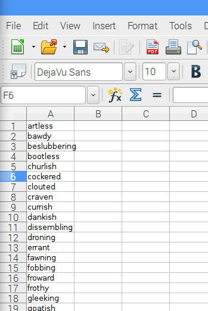
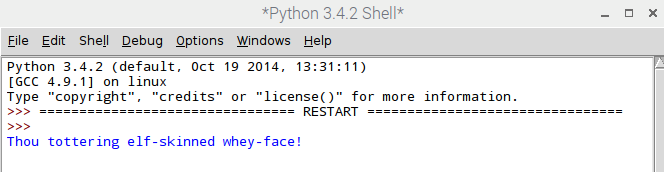
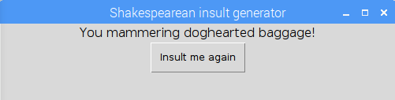

# Shakespearean insult generator

Ever been in the frustrating situation of being insulted by someone and wishing you had a bitingly funny zinger to come back with? In this resource you will write a Python script to generate insults, Elizabethan style.

## What is a CSV file?

A **Comma Separated Values** file (or CSV file as it is commonly known) is a very basic way of storing data for use in a Python program. It is simply a text file where the contents are in a specific format - separated by commas. For example, this could be an example of data stored in a CSV file:

```CSV
john, paul, george, ringo
```

Sometimes the values are **encapsulated**, for example they may be encapsulated with quotes like this:

```CSV
"john", "paul", "george", "ringo"
```

This is usually because the data itself contains commas, so we need to avoid confusion between where a comma represents a break between different data items, and where it is simply part of the data. For example in this CSV file encapsulation is definitely necessary:

```CSV
"Tabitha, slayer of mice", "Tiddles, drinker of milk", "Tiffany, leaver of hairballs"
```
The most basic way of creating a CSV file is to type data into a text file in CSV format, and then save the file with the extension `.csv`. Alternatively you could use a program such as LibreOffice Calc or Microsoft Excel to create and save a file in CSV format.

## Putting your insults into a CSV file

1. You will need to find some suitable Shakespearean words to use. Make sure to only use Shakespearean words as insults - they are witty, intelligent and unlikely to actually offend your friends! We found a big list of [Shakespearean insults](https://www.theatrefolk.com/free-resources) on this page (scroll down to the "Fun activities" section).

1. Now open up a document in a spreadsheet editor. These instructions are for LibreOffice Calc, which is included on the latest distribution of Raspbian, but this process works in a very similar way in other spreadsheet programs such as Microsoft Excel. Copy the first column of insults from the pdf file. Now right click on cell A1 in your spreadsheet and select **Paste Special**. In the popup box which appears, make sure **Unformatted text** is selected before pressing OK. Then press OK again when you are presented with the box below.

  

  You should see your insult words displayed in the spreadsheet, with one word in each row, like this:

  


1. Repeat this for the second and third columns, pasting them into columns B and C of the spreadsheet.

  

1. Now save your file as `insults` and make sure to change the `File type` drop down to `Text CSV` before pressing save.

  

1. If a box pops up, choose to save the file in Text CSV format. Press OK on any further pop-ups.

  

1. Once your file has been saved, you can check that the data is now in CSV format. Locate the file using the file explorer, then right click on the file and select "Text editor" to open it up as plain text. You should see the insults you pasted in, separated by commas.

  

## Open and read from a file

1. Now we need to read this file of insults into Python. From the `Programming` menu, open up `Python 3 (IDLE)`.

1. Click `File` > `New File` and save the file as `shakespeare.py`

1. Add the following code to open the file (`insults.csv`) in read mode (`"r"` means *read mode*), read the full contents, and output the result:

  ```python
  with open("insults.csv", "r") as f:
    contents = f.read()
    print(contents)
  ```

1. What is the difference between the current line of code...

  ```Python
  contents = f.read()
  ```

  ...and this line of code?

  ```Python
  contents = f.readline()
  ```

  Change the code and see if you can work out the difference betweeen `read()` and `readline()`

1. So far we are able to read the insults from the file in the order they were written, but we can't do much with them. You may have noticed that the different columns forming the parts of the insult were different types of word. The first two columns (A and B) contain **adjectives** (describing words) and the final column (C) contains **nouns**, mostly in this case referring to a 'thing' the person resembles. If we could split them up, we could make insults of the form "Thou [List A] [List B] [List C]" by choosing a random word from each list. An example might be "Thou impertinent rump-fed miscreant".

## Lists in Python

1. We will add some code to read the file line by line and split each column into a separate list. Try planning this yourself in pseudo code before looking at our solution below:

  ```
  CREATE list_a, list_b, list_c as BLANK LISTS
  OPEN insults.csv in read mode
    FOR each line in the file, READ INTO variable line
      words = SPLIT line EVERY "," INTO A LIST
      APPEND first word IN words TO list_a
      APPEND second word IN words TO list_b
      APPEND third word IN words TO list_c
    END WHILE
  PRINT list_a
  ```

  The most unfamiliar part of this code is probably `words = SPLIT line EVERY "," INTO A LIST`. Here we will use Python's built in `split()` function to split up the line of text wherever there is a comma, and save the results as a list called `words`.

1. Here is the corresponding Python code for the code we planned above. Once again, you could have a go at translating your pseudo code into Python before you look at the solution below. Delete your existing code and replace it with the new code:

  ```python
  list_a = []
  list_b = []
  list_c = []

  with open("insults.csv", "r") as f:
      for line in f:
          words = line.split(",")
          list_a.append(words[0])
          list_b.append(words[1])
          list_c.append(words[2])

  print( list_a )

  ```
1. Save and run your program by pressing `F5`. You should find that the program outputs a list of all of the words you put in column A.

  

1. Change your code to print out and check lists B and C too. You should spot a problem.

1. When you output `list_c` to check it, you will notice something strange - an extra `\n` character has been added to the end of each of the words:

  

  The `\n` character is not a surprise when you find out that it means "new line". It is there because in our original CSV file, each group of three insult words were stored on a *new line*! However, we don't want to display it in our insult, so we can add some code to get rid of it.

1. Find this line in your code:

  ```python
  list_c.append(words[2])
  ```

  ...and add `.strip()` on the end of the word you are appending, to automatically strip out the `\n` and any other **whitespace characters**.

  ```python
  list_c.append( words[2].strip() )
  ```

## Randomly choosing an insult

Now we have three lists, let's write a function to choose a random word from each list and create a new insult.

1. At the very start of your program, import the random library

  ```python
  import random
  ```

1. Immediately underneath that, define a function called `insult_me()`

  ```python
  def insult_me():
  ```

1. We can tell Python which code is inside the function by *indenting* the lines of code after the function definition. Add some code *inside the function* to choose a random word from `list_a`, `list_b` and `list_c`. The first word has been done for you in the example below, but you need to work out how to choose a random word from lists B and C yourself.

  ```python
  def insult_me():
    word_a = random.choice(list_a)
  ```

1. Still writing your code *inside the function*, construct your insult, using the *concatenation* symbol (`+`) to join the words together. Then add a `print` statement to display the insult:

  ```python
  insult = "Thou" + word_a + word_b + word_c
  print(insult)
  ```

1. If you run your program now, nothing new will happen. This is because code inside a function will not be executed until the function is **called**. Find the line of code in your program where you `print( list_a )` and delete it. In its place, call the function you just created:

  ```python
  insult_me()
  ```

1. Save your program and run it using `F5`. You should see a random insult, but there is a problem - the words are all stuck together with no spaces in between!

  

  The `+` is like the programmer's glue - it joins **strings** together. The string for a space is `" "`, so we could alter the code and put a space between `word_a` and `word_b` like this:

  ```python
  insult = "Thou" + word_a + " " + word_b + word_c
  ```

  See if you can work out where to *concatenate* in more spaces to make the insult display properly. You could even concatenate a `"!"` onto the end of your insult if you like.

1. Save and run your program using `F5`. You should see a random insult appear!

    

    Run your program again and you should see a different insult each time.

## Displaying the result on a GUI

If you would like to make your insult generator easy to use, you could add a basic GUI. Ensure you have followed the [software installation instructions](software.md) to install the guizero library before attempting this section.

1. At the start of your program, after the line of code where you imported the random library, import the guizero library:

  ```python
  from guizero import App, Text, PushButton
  ```

1. Now at the very end of your program, add code to create an `App`. This is a simple GUI window where we will display your insult.

  ```python
  app = App("Shakespearean insult generator")
  app.display()
  ```

1. Save your code and run it using F5. You should see a mainly blank window pop up, with the title "Shakespearean insult generator".

  

  You might notice that when you run the program, an insult is still printed out in the Python shell, even though we now want to display our insult on the GUI. This is because we coded the `insult_me()` function to *print* the insult rather than just generate it.

1. Go back to your `insult_me()` function and replace the line `print(insult)` with the line `return insult`. This will cause the insult to be passed back from the function so we can use it, instead of just printed out.

1. Delete the line of code which calls the function `insult_me()`.

1. Now add some `Text` to display your insult. This line of code should go between the `app =` line and the `app.display()` line:

  ```python
  message = Text(app, insult_me() )
  ```

  This line of code creates a `Text` object, adds it to the `app`, and then calls the function `insult_me()` to get an insult to display.

  

1. Now let's add a `PushButton` on the line immediately after the `Text`.

  ```python
  button = PushButton(app, new_insult, text="Insult me again")
  ```

  This code creates a `PushButton` object and adds it to the `app`. The button will call the function `new_insult` (which we haven't written yet) when it is pressed, and will display the text `"Insult me again"`.

1. Write the function `new_insult()` which will be called when the button is pressed. You should put this code immediately after your `insult_me()` function, but be careful **not** to indent the first line of the function, otherwise Python will think this code is part of the `insult_me()` function too.

  ```python
  def new_insult():
    new_insult = insult_me()
    message.set(new_insult)
  ```

  This function calls the `insult_me()` function to generate a new random insult, and then sets the message on the GUI to be the newly generated insult.

  

1. Run the program using `F5` and enjoy creating a stream of Shakespearean insults at the press of a button! The finished code is [here](code/shakespeare.py) if you want to check your code.

## What next
- Could you change the colour or size of the text on the GUI? Check out the [documentation](https://lawsie.github.io/guizero/text/) to help you.
- Could you change the GUI so that it contains three drop down boxes, each containing one of the lists of words. Users can pick their own insult using the three drop down boxes?
- Could you allow users to rate the insults and save the full insult plus its rating into a separate CSV file?
- Could you read this CSV file and calculate the highest rated insult?
